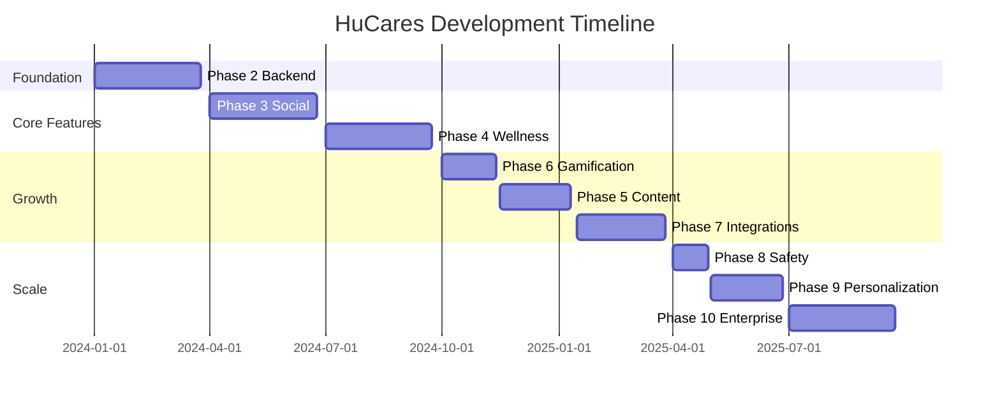

# HuCares Master Implementation Guide 🚀

## 🎯 **MISSION STATEMENT**
Transform HuCares from a 10/10 MVP with localStorage into a comprehensive wellness platform that rivals industry leaders while maintaining its core celebration-focused philosophy.

---

## 📋 **IMPLEMENTATION OVERVIEW**

### **Current State Assessment**
- ✅ **Solid MVP Foundation**: React + TypeScript, 4-question check-ins, group functionality
- ✅ **Beautiful UI**: Celebration-focused design, PWA capabilities  
- ✅ **Core Features Working**: User auth, group management, score calculation
- ⚠️ **Critical Gap**: localStorage-only (no backend, no real-time, no multi-device)

### **Target State Vision**
- 🏗️ **Enterprise-Grade Backend**: Real authentication, real-time sync, multi-device
- 🤝 **Rich Social Platform**: Comments, reactions, messaging, celebrations
- 🧠 **Advanced Wellness**: Custom surveys, habit tracking, goal setting, AI insights
- 🎮 **Engaging Experience**: Gamification, achievements, challenges, rewards
- 🌍 **Ecosystem Integration**: Health apps, wearables, professional tools
- 🏢 **Revenue Streams**: Professional tools, enterprise wellness, premium features

---

## 🗺️ **PHASE EXECUTION STRATEGY**

### **CRITICAL PATH: Foundation First** 
```
Phase 2 (Backend) → Phase 3 (Social) → Phase 4 (Wellness) → Phases 5-10 (Growth)
```

**Rationale**: 
- Backend is prerequisite for all other features
- Social features differentiate from competitors  
- Advanced wellness creates product depth
- Growth phases enable scale and monetization

### **PARALLEL DEVELOPMENT TRACKS**



---

## 🏗️ **TECHNICAL ARCHITECTURE EVOLUTION**

### **Phase 1: Current (localStorage MVP)**
```
Frontend (React/TypeScript) → localStorage → No Backend
```

### **Phase 2: Backend Foundation**
```
Frontend ↔ REST API ↔ PostgreSQL
         ↔ Socket.io ↔ Redis
```

### **Phase 3+: Full Stack Platform**
```
Frontend (React/TypeScript)
    ↕
API Gateway (Express.js)
    ↕
Microservices (Auth, Social, Wellness, Gamification)
    ↕
Databases (PostgreSQL, Redis, S3)
    ↕
External APIs (Health Apps, Payment, Email)
```

---

## 🛠️ **DEVELOPMENT METHODOLOGY**

### **Agile + Checklist-Driven Approach**

**Sprint Structure:**
- **2-week sprints** within each phase
- **Demo at end of each sprint** 
- **User feedback incorporated** before next sprint
- **One checklist item completed** per sprint focus

**Quality Gates:**
- [ ] Feature complete with tests
- [ ] Performance benchmarks met
- [ ] User acceptance criteria satisfied
- [ ] Security review passed
- [ ] Documentation updated

### **Team Structure Evolution**

```
Phase 2-4: Core Team (2-3 developers)
├── Full-stack developer (backend focus)
├── Frontend developer (React/TypeScript)
└── DevOps/Infrastructure engineer

Phase 5-7: Growth Team (3-4 developers)  
├── Core team continues
├── Additional full-stack developer
└── Part-time mobile developer

Phase 8-10: Scale Team (4-6 developers)
├── Growth team continues  
├── Security specialist
├── Data engineer
└── Additional frontend developer
```

---

## 📊 **SUCCESS METRICS BY PHASE**

### **Phase 2: Backend & Real-time**
```
Technical Metrics:
├── API response time: <200ms (95th percentile)
├── Database queries: <100ms average
├── Real-time latency: <50ms event propagation
├── Uptime: 99.9% availability
└── Test coverage: 90%+ code coverage

User Metrics:
├── Migration success: 100% localStorage → backend
├── Multi-device usage: 60%+ users access from >1 device
├── Real-time engagement: 80%+ users see live notifications
└── Performance satisfaction: No complaints about slowdown
```

### **Phase 3: Enhanced Social**
```
Engagement Metrics:
├── Comment adoption: 70%+ check-ins receive comments
├── Reaction usage: 90%+ check-ins receive reactions
├── Message activity: 50%+ users send messages weekly
├── Response rate: 80%+ encouragements get responses
└── Retention: 20% increase in weekly active users

Social Health:
├── Group cohesion: Average friendship score >7/10
├── Support network: Each user encouraged weekly
├── Positive sentiment: 90%+ comments positive
└── Milestone celebration: 95% milestones celebrated
```

### **Phase 4: Advanced Wellness**
```
Feature Adoption:
├── Custom templates: 40%+ groups create templates
├── Habit tracking: 60%+ users track ≥1 habit daily
├── Goal setting: 80%+ users set wellness goals
├── Daily logging: 70%+ users log mood/energy
└── Insights engagement: 90%+ users view weekly insights

Wellness Impact:
├── Correlation discovery: Meaningful patterns found
├── Goal achievement: 60%+ users reach goals
├── Habit consistency: 50%+ users maintain 30-day streaks
└── User satisfaction: 25% improvement in engagement
```

---

## 🚨 **RISK MITIGATION STRATEGIES**

### **Technical Risks**

**Backend Performance Risk**
- **Risk**: Backend slower than localStorage
- **Mitigation**: Aggressive caching, CDN, performance testing
- **Contingency**: Hybrid localStorage + backend sync

**Data Migration Risk**  
- **Risk**: Users lose data during migration
- **Mitigation**: Comprehensive migration tool, backup system
- **Contingency**: Rollback capability, manual data recovery

**Real-time Complexity Risk**
- **Risk**: Socket.io connection issues at scale
- **Mitigation**: Connection pooling, fallback mechanisms
- **Contingency**: Polling fallback, message queuing

### **Business Risks**

**User Adoption Risk**
- **Risk**: Users don't adopt new features
- **Mitigation**: Gradual rollout, user feedback loops
- **Contingency**: Feature toggling, A/B testing

**Competitive Risk**
- **Risk**: Competitors launch similar features
- **Mitigation**: Unique celebration focus, rapid development
- **Contingency**: Patent filing, pivot strategy

**Resource Risk**
- **Risk**: Team capacity constraints
- **Mitigation**: Prioritized feature matrix, contractor support
- **Contingency**: Extended timelines, feature reduction

---

## 💰 **BUSINESS MODEL EVOLUTION**

### **Phase 1-3: Free Growth (0-24 months)**
- Core features remain free
- Focus on user acquisition and engagement
- Revenue: $0 (investment phase)

### **Phase 4-6: Freemium Introduction (24-36 months)**
```
Free Tier:
├── Basic check-ins and groups
├── Limited habit tracking (3 habits)
├── Basic analytics
└── Standard themes

Premium Tier ($4.99/month):
├── Unlimited custom check-ins
├── Advanced habit tracking
├── Detailed analytics and insights
├── Custom themes and personalization
└── Priority customer support
```

### **Phase 7-10: Professional & Enterprise (36+ months)**
```
Professional Tier ($19.99/month):
├── All premium features
├── Professional dashboard
├── Client management tools
├── White-label options
└── API access

Enterprise Tier ($199/month):
├── Corporate wellness programs
├── Team management dashboard
├── Advanced analytics and reporting
├── Custom integrations
├── Dedicated account management
└── Compliance features
```

**Revenue Projections:**
- Year 1: $0 (investment)
- Year 2: $50K (early premium adoption)
- Year 3: $500K (freemium + professional)
- Year 4: $2M (enterprise + scale)

---

## 🎯 **IMPLEMENTATION CHECKLIST MASTER**

### **Pre-Development Setup**
- [ ] Development environment standardized
- [ ] CI/CD pipeline established  
- [ ] Monitoring and alerting configured
- [ ] Security protocols implemented
- [ ] Team communication tools setup

### **Phase 2: Backend Foundation (Weeks 1-12)**
- [ ] Database schema designed and migrated
- [ ] Authentication system implemented
- [ ] Core API endpoints developed
- [ ] Real-time system operational
- [ ] Frontend integration completed
- [ ] Migration tool functional

### **Phase 3: Social Features (Weeks 13-24)** 
- [ ] Comments and reactions system
- [ ] Direct messaging platform
- [ ] Activity feed implementation
- [ ] Group chat functionality
- [ ] Milestone celebrations
- [ ] Encouragement engine

### **Phase 4: Advanced Wellness (Weeks 25-36)**
- [ ] Custom check-in templates
- [ ] Habit tracking system
- [ ] SMART goal framework
- [ ] Daily logging interface
- [ ] Wellness insights engine
- [ ] Correlation analysis

### **Phases 5-10: Growth & Scale (Weeks 37-84)**
- [ ] Content management system
- [ ] Gamification mechanics
- [ ] External integrations
- [ ] Safety and privacy features
- [ ] Personalization engine
- [ ] Professional/enterprise tools

---

## 🚀 **LAUNCH STRATEGY**

### **Beta Testing Program (Phase 2 Complete)**
```
Beta User Targets:
├── Current MVP users (migration testing)
├── 10 wellness professionals (feature validation)
├── 5 small groups (real-world usage)
└── Internal team dogfooding

Success Criteria:
├── 90%+ successful migration from localStorage
├── <5 critical bugs reported
├── Positive feedback on real-time features
└── Performance benchmarks met
```

### **Public Launch (Phase 3 Complete)**
```
Launch Channels:
├── Product Hunt launch
├── Wellness community outreach
├── Influencer partnerships
├── Content marketing campaign
└── App store optimization

Growth Targets:
├── 1,000 users in first month
├── 100 active groups
├── 50% weekly retention rate
└── 4.5+ app store rating
```

### **Scale Launch (Phase 4+ Complete)**
```
Enterprise Outreach:
├── Corporate wellness partnerships
├── Healthcare provider integrations
├── Educational institution licensing
├── Professional certification programs
└── Research collaboration agreements

Revenue Targets:
├── 10,000+ freemium users
├── 1,000+ premium subscribers
├── 50+ professional accounts
└── 10+ enterprise clients
```

---

## 🏆 **COMPETITIVE DIFFERENTIATION**

### **vs. Existing Wellness Apps**

**vs. MyFitnessPal:**
- ✅ Social celebration vs. individual tracking
- ✅ Group wellness vs. solo journey
- ✅ Holistic wellness vs. nutrition focus

**vs. Headspace:**
- ✅ Social support vs. individual meditation
- ✅ Comprehensive tracking vs. mindfulness only
- ✅ Friend encouragement vs. app-based guidance

**vs. Strava:**
- ✅ Mental wellness vs. fitness only
- ✅ Private groups vs. public competition
- ✅ Celebration vs. competition

### **Unique Value Propositions**
1. **Celebration-First Philosophy**: Focus on celebrating progress, not competing
2. **Holistic Friend Support**: Real friends encouraging real wellness
3. **4-Question Simplicity**: Easy weekly check-ins vs. complex daily tracking
4. **Private Group Intimacy**: Small trusted circles vs. massive social networks
5. **Professional Integration**: Therapist/coach tools built-in from day one

---

## 📚 **LEARNING & ITERATION**

### **Continuous Improvement Process**
```
Weekly Cycle:
├── User feedback collection
├── Analytics review
├── Feature usage analysis
├── Performance monitoring
└── Next sprint planning

Monthly Cycle:
├── User interviews (10-15 users)
├── Competitive analysis update
├── Feature prioritization review
├── Technical debt assessment
└── Team retrospective

Quarterly Cycle:
├── Strategic roadmap review
├── Business metrics analysis
├── Market positioning evaluation
├── Technology stack assessment
└── Team expansion planning
```

### **Data-Driven Decision Making**
- **A/B Test Everything**: UI changes, feature rollouts, messaging
- **User Journey Analytics**: Track every step from signup to retention
- **Cohort Analysis**: Understand user behavior patterns over time
- **Feature Flag System**: Enable/disable features for testing
- **Feedback Loop Integration**: Direct user feedback into development cycle

---

## 🎉 **VISION: THE FUTURE HUCARES**

### **2026 Vision Statement**
*"HuCares is the world's leading social wellness platform where friends celebrate life together through meaningful check-ins, supportive communities, and professional guidance. We've transformed how people think about wellness - from individual struggle to collective celebration."*

### **Key Achievements by 2026**
- 🌍 **100,000+ active users** across 50+ countries
- 🤝 **10,000+ wellness groups** supporting each other daily
- 💼 **1,000+ professionals** using HuCares for client support
- 🏢 **100+ enterprise clients** with corporate wellness programs
- 📊 **Millions of check-ins** creating meaningful wellness insights
- 🏆 **Industry recognition** as top social wellness platform

### **Platform Impact**
- **Personal**: Users report 40% improvement in wellness consistency
- **Social**: 95% of users feel more supported in their wellness journey  
- **Professional**: Therapists and coaches report better client outcomes
- **Corporate**: Companies see 25% reduction in wellness-related healthcare costs
- **Research**: Anonymized data contributes to wellness research breakthroughs

---

**With this master guide, we're not just building an app - we're building the future of social wellness! Let's make it happen! 🚀**

---

*"The best time to plant a tree was 20 years ago. The second best time is now."* 
*Let's plant the HuCares tree and watch it grow into a wellness forest! 🌳* 